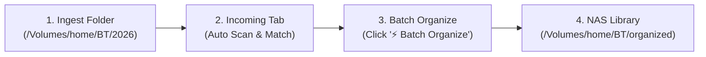

# 🎬 R19DEV Studio & Scraper

A modern, high-performance JAV video library scanner, pattern matcher, R18.dev metadata scraper, and Jellyfin NAS organizer written in Go. Available as both a **Single-Binary Web UI Studio** and an **Interactive Terminal TUI** with native GPU rendering.

---

## ✨ Key Features

### 🌐 1. Modern Web UI Studio (`r19dev web`)
- **Embedded Single Binary**: Built using Go's `embed.FS` — zero external runtime dependencies, zero Node.js required. Runs natively on macOS, Linux, or NAS servers.
- **⚡ Tier-1 Sub-Millisecond Offline Scraper (`r18_dump.db`)**:
  - Automatically queries a local SQLite database dump parsed from official R18.dev weekly dumps (`https://r18.dev/dumps`).
  - **1,902,762 movies**, **101,906 actresses**, **2,480,384 video-actress links**, and **540,500 DeepL English translations** indexed locally.
  - Queries return in **`< 1ms` (0.00s)** completely offline, eliminating Cloudflare HTTP 429 rate limits and IP blocks.
  - Graceful fallback: live HTTP queries are only executed for brand-new releases not yet present in the dump.
- **🗺️ Reorganized 3-Tier Navigation (User Journey Architecture)**:
  - **📥 Incoming** (Tab 1): Ingest new downloads, scan, rename, and batch organize.
  - **👤 Actresses** (Tab 2): Track followed performers, view solo collection completion %, and browse missing backlog.
  - **🎬 Library** (Tab 3): Standalone catalog for browsing all ready-to-watch titles on NAS with multi-criteria sorting (Date, Rating, Studio, Title) and status filters (All, In Library, Missing, Watched, Favorites).
- **🔌 100% Offline-Ready UI (Zero External CDN Dependencies)**:
  - All web fonts and icons are embedded locally in `pkg/web/static/fonts/` (`inter-variable.woff2`, `jetbrains-mono-latin.woff2`, `material-symbols-outlined.woff2`).
  - Works seamlessly on completely air-gapped local networks or offline NAS environments without broken icons or external Google Fonts CDN reliance.
- **🧩 Native ES Modules Architecture (`pkg/web/static/js/`)**:
  - Frontend codebase refactored from a monolithic script into 9 modular native browser ES modules (`state.js`, `api.js`, `modal.js`, `scanner.js`, `organizer.js`, `history.js`, `actress.js`, `graph.js`, `app.js`).
  - Zero build step, zero npm/Webpack/Vite tooling needed — runs natively in all modern browsers.
- **🔍 Universal Search in Sticky Top Header**:
  - Centered glassmorphism search input (`#universal-search-input`) pinned to the fixed navbar.
  - **Context-Aware Routing**: Automatically searches incoming files & SKU in Incoming tab, followed actresses in Directory view, and movie catalog in Library view.
  - **Keyboard Shortcuts**: Instant focus via **`⌘K`** (macOS) / **`Ctrl+K`** (Windows/Linux) or **`/`** (when browsing); **`Esc`** clears or blurs. Fully synchronized two-way with in-page search bars.
- **🚀 Sticky Breadcrumb & Floating Quick Navigation**:
  - Sticky Breadcrumb on top navbar (`[← All Actresses] / {Actress Name}`) accessible from any scroll depth.
  - Floating Quick Navigation Pill (`[← All Actresses] | [↑ Top]`) auto-reveals via glassmorphism when scrolling down $> 300\text{px}$ in long filmographies.
  - Full browser history (`history.pushState` & `popstate`) supporting trackpad two-finger swipe back and hardware back buttons.
- **📦 Multi-Part & Multi-File Aggregation**: Files belonging to the same movie (e.g. `_1.mp4`, `_2.mp4`, `-cd1.mp4`, `-cd2.mp4`) are automatically merged into a **single card** with part chips (`P1, P2 (2 parts • 8.4 GB)`).
- **🎛️ Dynamic Grid Density (1–5 Cards/Row)**: Adjust view layout from **1 card/row** (wide showcase layout with large cover) up to **5 cards/row** (compact grid) or **Auto**. Preferences are automatically saved in `localStorage`.
- **🖼️ Full-Width Hero Cover Modal**: Clicking any movie card displays a cinematic, full-width high-resolution cover banner with an ambient blurred backdrop, interactive rating stars (1–5 ⭐), watched toggle (👁️), favorite toggle (❤️), one-click `[🌐 R18.dev ↗]` outbound link, and direct full-screen zoom. For missing/unowned titles, the modal displays a dedicated `[🌐 View on R18.dev ↗]` primary action button to preview sample screenshots and trailers.
- **📸 High-Resolution Screenshot Lightbox**: Safe DMM high-resolution image upgrader (`jp-` format) with dual-layer fallback to prevent 404s, backend image proxy fallback, and `<meta name="referrer" content="no-referrer">` to prevent CDN hotlink blocking.
- **🌐 100% Verified R18.dev Outbound Navigation**:
  - Direct, 404-immune detail links (`https://r18.dev/videos/vod/movies/detail/-/id={content_id}/`) constructed using authentic DMM content IDs verified against `r18_dump.db` across 100% of the filmography catalog.
  - Hover actions on poster cards automatically adapt: shows `[📂 Finder]` for locally stored media, and replaces it with `[🌐 R18 ↗]` for missing/unowned releases.
  - Fully client-side (`<a target="_blank">`) ensuring zero external network calls on the backend and 100% offline-first reliability.
- **📊 Real-Time Streaming Progress Bars**: Live Server-Sent Events (SSE) stream progress bars for both **Scanning** (live file discovery & matching) and **NAS Organizing** (step-by-step progress, target path, and live console logs).
- **♿ WCAG 2.1 AA/AAA Compliant**: High-contrast typography, explicit `:focus-visible` keyboard rings, semantic landmark roles (`banner`, `main`, `tablist`, `progressbar`, `dialog`), `aria-label` tags, and a Skip-to-content navigation link.

### ⭐ 2. Actress Hub: 2-Column Bento Profile & Filmography Stage
- **🗂️ Followed & Unfollowed Actresses Directory**:
  - **Sub-Tabs (`Followed` vs. `Unfollowed`)**:
    - **Followed Actresses**: Solo filmographies, completion metrics, and latest release status for your tracked performers.
    - **Unfollowed Actresses**: Discovered performers found in local video files who are not yet tracked, with 1-click Follow.
  - **Balanced 2-Element Card Layout**:
    - **Left**: High-contrast status pill `[ ✓ SNOS-140 ]` (emerald green if downloaded in NAS, rose/amber with download icon if missing).
    - **Right**: Monospace release date `2026-03-24` (or `Recent`). Clean, compact, and immune to line breaks or text clipping.
  - **Clean Genuine Solo Releases Only**: Automated multi-layer gatekeeper strips compilation titles (総集編, BEST, BOX, `\d+連発`, `\d+連射`), photobooks, Tokuten duplicate SKUs (`TK-` prefixes, Cheki/生写真 photo sets), duplicate SKU formats (BOD, 9SNOS, K9SNOS), variety talk shows (`KCKC-`, `MLTN-`), AI Remaster re-issues (`JQRE-`, `AIリマスター`, `復刻`), and omnibus clip compilations (`RBB-`, `BMW-`, `REbecca STARS`, $\ge 10$ performers). Inspects both English and Japanese original titles simultaneously.
  - **Canonical SKU Prioritization**: Smart deduplication engine groups releases by canonical base ID (stripping `TK`, `-EC`) and normalized original title, demoting promo SKUs so standard canonical releases (`CJOD-510`, `MFYD-123`) always win.
  - **Minimalist Progress Line**: Clean 6px track displaying exact downloaded count and completion percentage: `${dl}/${total} (${pct}%)`.
  - **Instant Search & Multi-Sort**: Search by Romaji or Japanese name, and sort by `% Completed`, `Most Missing`, `Name A-Z`, or `Total Works`.
- **🍱 2-Column Bento Profile & Dedicated Filmography Stage**:
  - **Left Sticky Bento Profile Sidebar (~340px)**:
    - **Bento 1 (Identity)**: 140px HD avatar with hover zoom, bold Romaji name, Japanese Kanji name, verified R18 ID badge (`#1089946`), and dynamic **Career Span** (`📅 2021 – 2026`). All 37 followed actresses are 100% matched to authentic DMM IDs.
    - **Bento 2 (Library & Storage)**: Prominent gradient highlight of **Total NAS Storage** occupied (e.g. `20.21 GB`), visual collection progress bar, and average file size (`Avg 5.1 GB / file`).
    - **Bento 3 (Top Genres)**: Interactive tag cloud displaying the actress's top 8 most frequent genres with counts (e.g. `#Slender (14)`, `#VR (6)`). **Clicking any genre instantly filters her filmography on the right stage**.
    - **Bento 4 (Quick Actions)**: One-click `[📂 Open in Finder]` directly into her NAS directory, `[🌐 R18.dev Profile ↗]` (direct to verified actress page), and `[🔄 Refresh Releases]`.
  - **Right Filmography Main Stage**:
    - **Interactive Stage Toolbar**: Real-time in-page search input (filter instantly by ID like `SNOS` or title), sub-filter pills (`All Works`, `In Library`, `Missing`, and **`Skipped`**), active genre filter chip with 1-click removal, and a **Sort Dropdown** (`Release Date (Newest)`, `Release Date (Oldest)`, `File Size (Largest)`, `Movie ID (A-Z)`).
    - **Audit Filtered Works (`Skipped` Tab)**: Dedicated sub-filter displaying all non-solo or duplicate titles excluded by the gatekeeper (with specific skip reason badges like `Omnibus Compilation`, `AI Remaster`, `Variety Talk Show`, etc.) so no titles are mysteriously lost.
    - **Uniform Poster Grid**: Eye-friendly, standardized aspect ratio poster cards with hover actions (`▶ Details`, `📋 Copy ID`, `📂 Finder` / `🌐 R18 ↗`).
    - **Responsive Design**: Automatically stacks smoothly to 1 column on mobile/tablet viewports (<960px).
- **💬 Optional Chat Timeline Mode**: Toggle into a messaging interface (LINE / Discord style) where followed actresses announce their releases chronologically with unacquired grayscale styling and library status bubbles with inline R18.dev link buttons.

### 📂 3. NAS Directory Organizer & Jellyfin Pipeline
- Organizes videos into the standardized folder structure:
  ```
  /Volumes/home/BT/organized/{Actress_English_Name}/{JAV-ID} {English_Title}/
  ```
  - **English Naming Priority**: Folders prioritize English/Romaji names for both Actresses and Titles, seamlessly falling back to Japanese only if English metadata is unavailable.
  - **Multi-Actress Group Work Prioritization**: When organizing group or crossover works (e.g. duo or harem titles), the organizer prioritizes placing the physical directory under **followed/tracked actresses** over untracked co-stars.
  - **Zero Storage Waste (Single Physical Instance)**: Video files reside in exactly one physical folder on the NAS without duplication. Both Jellyfin (via multi-`<actor>` NFO tags) and R19DEV Studio (via SQLite metadata linking) display the movie under all participating co-stars' libraries simultaneously.
  - **Filesystem Safety**: Names are safely capped at 180 bytes with UTF-8 boundary validation to prevent OS filesystem `ENAMETOOLONG` errors (255-byte `NAME_MAX`).
- **Consolidation**: Consolidates multi-part videos (e.g. `SNOS-038-cd1.mp4`, `SNOS-038-cd2.mp4`) into single unified Jellyfin movie entries.
- **Jellyfin Metadata (.nfo)**: Generates official Kodi/Jellyfin Movie NFO XML with title, original title, plot, studio, release date, runtime, actresses with thumbnail URLs, genres, watched status, and user ratings.
- **🎬 Cinematic Standalone `movie.html` (Offline-First Interactive Viewer)**:
  - **Ambient Backdrop Hero**: Features full-width `fanart.jpg` backdrop with cinematic blur and dark gradient overlay, mirroring modern streaming UI aesthetics (Netflix, Apple TV).
  - **Direct Play Action Bar**: Includes prominent `▶ Play Movie` button launching the video in your OS default player (VLC, IINA, QuickTime) and a `🖥️ Watch in Browser` pop-up HTML5 video player.
  - **Smart Multi-Part Handling**: Automatically detects multi-part files (e.g. `-pt1.mp4`, `-pt2.mp4` / `cd1`, `cd2`) and renders dedicated `▶ Play Part 1` and `▶ Play Part 2` buttons.
  - **In-Page Lightbox Gallery**: Browsing sample screenshots opens a fluid, full-screen in-page modal without opening disruptive new browser tabs. Supports keyboard navigation (`←` / `→` arrows, `Esc` to close) and image counter.
  - **Utility Toolbar**: One-click JAV ID copy (`📋 {JAV-ID}`) with floating toast notification, `🎬 Watch Trailer` button, and direct deep-link back to `🏠 R19dev Hub`.
  - **Local Asset Auto-Discovery**: Intelligently scans local `extrafanart/` and video files on disk, ensuring 100% offline functionality with zero external CDN dependencies.
- **⚡ High-Speed SMB Network Scanner**:
  - Optimized directory crawler instantly skips non-video directories (`.actors`, `extrafanart`, `@eaDir`, and hidden directories) without redundant `os.Lstat` calls, reducing network SMB traversal times across thousands of files from timeouts down to seconds.
- **High-Res Assets & Resilient Serving**: Downloads full-resolution `poster.jpg` (cover jacket), `fanart.jpg` (backdrop), and all sample gallery screenshots into `extrafanart/`. The web server features a multi-tier fallback for `/api/images/{id}` (RAM cache $\rightarrow$ local organized disk poster $\rightarrow$ remote DMM/R18 fetch) ensuring posters are always displayed.
- **One-Click Reveal in Finder / File Manager**: Click `[📂 Open in Finder]` directly on any card or modal to immediately reveal the organized files in macOS Finder, Windows Explorer, or Linux.
- **Safe Dry-Run Mode**: Supports `--dry-run` to preview all target folder moves and asset creations safely before applying changes.

### 🚚 4. High-Speed Batch Migrator (`r19dev migrate`)
- **Interactive Live Migration TUI**: Powered by Charm Bubble Tea with real-time percentage progress bar, speed tracker (`1.1/s`), live status card, and scrolling activity logs.
- **🛡️ Smart Collision & Quality Protection**:
  - **Zero Destructive Overwrites**: Automatically detects existing titles in target destinations. Instead of overwriting or erroring out, it merges complementary assets safely.
  - **Quality Coexistence**: Safely co-locates 4K editions (`-4k.mp4`), 1080p standard editions (`.mp4`), and uncensored editions (`-uncensored.mp4`) in the same movie folder.
  - **Multi-Part Integrity**: Preserves and standardizes multi-part CD files (`-cd1.mp4` through `-cd5.mp4`), keeping all discs grouped in the single movie directory.
- **📋 Pre-Flight Safety Confirmation**: Scans the source tree, maps metadata against `r18_dump.db`, resolves destination paths, and pauses for explicit operator confirmation (`[Enter] PROCEED` / `[q] CANCEL`) before moving a single byte.
- **⚡ Concurrent Worker Pool & Zero-Lag Discovery**:
  - Automatically queries `organized_movies` SQLite table in `< 0.01s` for instant library lookups without slow recursive SMB network traversal.
  - Upgrades library `movie.html` files with a **16-worker concurrent pool**, reducing re-render times from minutes to seconds.
- **🧹 Safe Source Directory Tree Cleanup**: Post-order traversal safely removes only empty parent folders in the source directory after files are migrated, while preserving non-empty folders containing skipped or foreign media.

### 📜 5. Console Log & SQLite Operation History (Audit Trail)
- **Smart Auto-Scroll**: Console Log automatically pauses auto-scrolling when the user scrolls up to inspect previous lines (`Auto-Scroll: PAUSED`), displaying a floating `⬇️ New logs below (Click to resume)` button.
- **One-Click Log Copy**: Instant `📋 Copy` button to copy complete console logs to the clipboard.
- **SQLite Operation History (`operation_history`)**: All batch and single Organize/Scrape operations are automatically recorded into SQLite with complete timestamps, counts (success/fail), parameters, and full audit logs.
- **Zero Clutter & Auto-Retention**: Auto-prunes entries older than 30 days and maintains a maximum of 100 entries, ensuring a tiny database footprint with zero disk clutter.
- **History Viewer Modal**: Accessible via `📜 History` on the console header with full detail inspection and log copying.

### 🖥️ 5. Interactive Terminal TUI (`r19dev tui`)
- Built with Charm's **Bubble Tea** and **Lip Gloss**.
- **Kitty GPU Graphics Protocol**: Native pixel-perfect bitmap rendering on Kitty, Ghostty, and WezTerm.
- **iTerm2 Inline Images Protocol**: Native bitmap rendering on iTerm2, WezTerm, Warp, and VS Code.
- **Sixel Graphics Protocol**: 6-pixel band bitmap rendering on Foot, XTerm, and Sixel-enabled terminals.
- **24-bit Truecolor Half-Block (`▀`)**: Universal fallback for any terminal emulator.
- Quick shortcut keys: `Enter` to scrape, `v` for Kitty GPU cover, `t` for watched, `1`-`5` to rate, `a` to follow actress, `w` to organize.

---

## 🧭 Step-by-Step User Journeys (คู่มือการใช้งานแต่ละ Journey)

### 📥 Journey 1: จัดระเบียบไฟล์หนังใหม่เข้า NAS Jellyfin (Ingest & Organize)
**เป้าหมาย**: ดาวน์โหลดไฟล์หนังมาไว้ในโฟลเดอร์ (เช่น `/Volumes/home/BT/2026`) และต้องการให้ระบบจัดระเบียบสร้างโฟลเดอร์ตามชื่อนักแสดง โหลดโปสเตอร์ แบคดรอป ภาพตัวอย่าง และสร้างไฟล์ Jellyfin NFO + movie.html



1. **เปิด Web UI Studio**:
   ```bash
   ./bin/r19dev web /Volumes/home/BT/2026
   ```
2. **ไปที่แท็บ `📥 Incoming`**:
   - ระบบจะสแกนโฟลเดอร์และ Match รหัส JAV ID ให้อัตโนมัติในเสี้ยววินาที (<1ms จาก `r18_dump.db`)
   - ไฟล์ที่เป็น Multi-part (เช่น `-cd1.mp4`, `-cd2.mp4`) จะถูกรวมเป็นการ์ดเดียวอัตโนมัติ
3. **กำหนดโฟลเดอร์ปลายทาง (Destination Root)**:
   - ค่าเริ่มต้น: `/Volumes/home/BT/organized` (หรือเลือกเปลี่ยนปลายทางได้ตามต้องการ)
4. **กดปุ่ม `⚡ Batch Organize`**:
   - ระบบจะย้ายไฟล์หนังเข้าสู่โครงสร้าง: `{Dest}/{Actress_Name}/{JAV-ID} {English_Title}/`
   - ดาวน์โหลด `poster.jpg`, `fanart.jpg`, และภาพตัวอย่างใส่โฟลเดอร์ `extrafanart/`
   - สร้างไฟล์ `{JAV-ID}.nfo` สำหรับ Jellyfin และ `movie.html` สำหรับเปิดดูออฟไลน์

---

### 👤 Journey 2: ติดตามนักแสดงคนโปรด & ตรวจสอบผลงานที่ยังขาด (Actress Hub & Backlog Tracker)
**เป้าหมาย**: เช็คประวัติผลงาน (Solo Filmography), ดูเปอร์เซ็นต์สะสม (% Completed), สตอเรจที่ใช้ใน NAS, และหาผลงานที่ยังขาด

1. **ไปที่แท็บ `👤 Actresses`**:
   - ดูรายชื่อนักแสดงที่ติดตาม (Followed Actresses) พร้อมเปอร์เซ็นต์สะสม เช่น `24/30 (80%)` และพื้นที่จัดเก็บ
   - ดูนักแสดงที่พบในไฟล์แต่ยังไม่ได้ติดตามในแท็บ `Unfollowed` และกด `+ Follow` ได้ใน 1 คลิก
2. **คลิกเลือกนักแสดง**:
   - **แถบซ้าย (Bento Sidebar)**: แสดงรูปโปรไฟล์ HD, รหัส R18 ID, ช่วงปีที่แสดง (Career Span), พื้นที่ NAS ที่ใช้, และ Top Genres (คลิกแท็กแนวเพื่อกรองได้ทันที)
   - **แถบขวา (Filmography Stage)**: แสดงผลงานทั้งหมด เรียงตามวันที่วางจำหน่าย
3. **ใช้งาน Sub-Filters & Quick Actions**:
   - `All Works`: ผลงานทั้งหมดของนักแสดง
   - `In Library`: เฉพาะเรื่องที่มีอยู่ใน NAS (กดปุ่ม `[📂 Finder]` เพื่อเปิดไฟล์ในเครื่องได้ทันที)
   - `Missing`: เรื่องที่ยังไม่มีใน NAS (กดปุ่ม `[🌐 R18 ↗]` เพื่อดูรายละเอียด/ตัวอย่างบน R18.dev)
   - `Skipped`: เรื่องที่ถูกคัดกรองออก (เช่น รวมฮิต/Best, รายการทอล์คโชว์, โฟโต้บุ๊ค) พร้อมแสดงเหตุผลชัดเจน

---

### 🎬 Journey 3: ค้นหาและเปิดดูหนังในคลัง (Library Catalog & Universal Search)
**เป้าหมาย**: เปิดดูคลังหนังทั้งหมดที่มีอยู่ใน NAS แบบ Cinematic และค้นหาหนังได้อย่างรวดเร็ว

1. **กดปุ่มลัด `⌘K` (macOS) หรือ `Ctrl+K` (Windows/Linux)** หรือพิมพ์ในช่อง Search Bar ด้านบน:
   - ค้นหาได้ทันทีทั้งรหัส JAV (เช่น `SNOS`, `IPX`), ชื่อเรื่องภาษาอังกฤษ/ญี่ปุ่น, หรือชื่อนักแสดง
2. **ไปที่แท็บ `🎬 Library`**:
   - แสดงรายการหนังทั้งหมดที่พร้อมดู กรองตามสถานะ: `All`, `Watched (👁️)`, `Favorites (❤️)`, `Rated (⭐)`
   - ปรับ Grid Density ได้ 1 ถึง 5 การ์ดต่อแถว หรือกดเรียงตาม วันที่ / เรตติ้ง / ค่าย / รหัส
3. **คลิกการ์ดหนังเพื่อเปิด Hero Modal**:
   - แสดงภาพปกใหญ่คมชัดระดับ HD พร้อม Ambient Backdrop
   - ให้คะแนน 1-5 ดาว ⭐, กดปุ่มดูแล้ว 👁️, หรือกดถูกใจ ❤️
   - กดปุ่ม `▶ Play Movie` เพื่อเล่นไฟล์ผ่านโปรแกรมเล่นวิดีโอ (VLC, IINA) หรือเปิดดูบนเบราว์เซอร์
   - เลื่อนดู Gallery ภาพตัวอย่างและกดดูภาพขยายแบบ Lightbox

---

### 🎛️ Journey 4: ปรับแต่งตัวกรองหนังรวมฮิต/ของแถม (Customizing Filter Rules)
**เป้าหมาย**: ต้องการเพิ่ม/ลดรหัส Prefix, ค่าย (Label), ซีรีส์ (Series), หรือคำค้น (Keywords) ที่ไม่ต้องการให้แสดงในระบบ

1. **ดูการตั้งค่าตัวกรองปัจจุบัน**:
   ```bash
   ./bin/r19dev filters show
   # หรือดู path ของไฟล์:
   ./bin/r19dev filters path
   ```
2. **แก้ไขไฟล์ `filters.json`**:
   - ไฟล์อยู่ที่: `~/Library/Application Support/r19dev/filters.json` (macOS) หรือ `~/.config/r19dev/filters.json` (Linux)
   - สามารถเพิ่ม Prefix เช่น `"IPOK"`, `"MIZD"`, ชื่อค่าย `"Idea Pocket BEST"`, คำในชื่อเรื่อง `"100本番"`, หรือคำอื่นๆ
   ```json
   {
     "version": 1,
     "enabled": true,
     "blocked_prefixes": [
       "IPOK", "IDBD", "MIZD", "MIDD", "PBD", "OBST", "SDDE",
       "RBB", "MKCK", "MKMP", "OFJE", "SETH", "OFRF", "OFMA",
       "KCKC", "MLTN", "BMW", "B600", "D600", "DG", "JQRE"
     ],
     "blocked_labels": [
       "Idea Pocket BEST", "MOODYZ Best", "PREMIUM BEST", "SOD BEST",
       "Madonna BEST", "S1 NO.1 STYLE BEST", "BEST", "ベスト", "総集編"
     ],
     "blocked_title_keywords": [
       "100本番", "ベストセレクション", "BESTセレクション", "総集編", "オムニバス",
       "傑作選", "名場面", "全集", "メモリアル", "プレミアムベスト", "連発", "連射"
     ]
   }
   ```
3. **สั่ง Purge ลบหนังที่ไม่ต้องการออกจากฐานข้อมูลทันที**:
   ```bash
   ./bin/r19dev filters purge
   ```
   *(หรือสามารถเรียกผ่าน REST API: `POST /api/filters` เพื่ออัปเดตและสั่ง purge อัตโนมัติ)*
4. **รีเซ็ตการตั้งค่ากลับเป็นค่าเริ่มต้น (หากต้องการ)**:
   ```bash
   ./bin/r19dev filters reset
   ```

---

### 🚚 Journey 5: ย้ายคลังหนังขนาดใหญ่แบบ Batch Migration (`r19dev migrate`)
**เป้าหมาย**: ย้ายไฟล์หนังจำนวนมากจากโฟลเดอร์เก่าเข้าสู่คลัง NAS พร้อมสร้าง Metadata แบบความเร็วสูง

1. **รันคำสั่ง Interactive TUI Migration**:
   ```bash
   ./bin/r19dev migrate /Volumes/home/BT/OldMovies /Volumes/home/BT/organized
   ```
2. **ตรวจสอบหน้าสรุป Pre-flight**:
   - ระบบจะตรวจเช็ครหัสหนังกับ `r18_dump.db` ออฟไลน์ (<1ms ต่อเรื่อง) และคำนวณปลายทางให้ล่วงหน้า
   - กด `Enter` เพื่อยืนยันการย้ายไฟล์ หรือกด `q` เพื่อยกเลิก
3. **ติดตามสถานะสด (Live Progress Bar & Speed Tracker)**:
   - แสดง Progress Bar แบบเปอร์เซ็นต์, ความเร็วในการย้าย (เช่น `1.2 movies/s`), และ Log การย้ายแบบเรียลไทม์
4. **โหมดคำสั่งสำหรับรันสคริปต์อัตโนมัติ (Headless / Non-Interactive)**:
   ```bash
   ./bin/r19dev migrate /Volumes/home/BT/OldMovies /Volumes/home/BT/organized --yes --no-tui
   ```

---

### 🛠️ Journey 6: อัปเกรดหน้าเว็บหนัง `movie.html` ทั้งหมดในคลัง (`r19dev upgrade-html`)
**เป้าหมาย**: ปรับปรุงหน้า `movie.html` ที่มีอยู่เดิมใน NAS ให้เป็น Cinematic Template รุ่นล่าสุดแบบพร้อมกันหลาย Thread

1. **รันคำสั่ง Upgrade**:
   ```bash
   ./bin/r19dev upgrade-html /Volumes/home/BT/organized
   ```
2. ระบบจะใช้ Worker Pool 16 คอร์ทำการ Render ไฟล์ `movie.html` ใหม่ทั้งหมดด้วยความเร็วสูง (~50-100 ไฟล์/วินาที)

---

### 💾 Journey 7: สำรองข้อมูลฐานข้อมูล (`r19dev backup`)
**เป้าหมาย**: สร้าง Snapshot สำรองของฐานข้อมูล `r19dev.db` ไปเก็บไว้บน NAS เพื่อป้องกันข้อมูลสูญหาย

1. **รันคำสั่ง Backup**:
   ```bash
   ./bin/r19dev backup /Volumes/home/BT/organized
   ```
2. ไฟล์สำรองจะถูกบันทึกเป็น `.r19dev_backup.db` บน NAS อัตโนมัติ (และสามารถกดปุ่ม `[💾 Backup DB]` ผ่าน Web UI History Modal ได้เช่นกัน)

---

## 🚀 Quick Start

### 1. Build Single Binary
```bash
make build
# Compiles standalone binary to ./bin/r19dev
```

### 2. Launch Web UI Studio (Recommended)
```bash
# Launches web server & opens browser automatically at http://localhost:8080
./bin/r19dev web /Volumes/home/BT/2026

# Custom port or no-open mode for headless servers / NAS:
./bin/r19dev web /Volumes/home/BT/2026 --port 9090 --no-open
```

### 3. Launch Interactive Terminal TUI
```bash
# Auto-detect terminal graphics capability
./bin/r19dev tui /Volumes/home/BT/2026

# Force Kitty GPU protocol (Ghostty / Kitty):
./bin/r19dev tui /Volumes/home/BT/2026 --proto kitty
```

### 4. Actress Tracking via CLI
```bash
# Follow an actress
./bin/r19dev actress follow "Kanna Seto"

# List followed actresses
./bin/r19dev actress list

# Check new releases vs local library
./bin/r19dev actress check
```

### 5. Filter Rules Management (`r19dev filters`)
```bash
# Show current filter configuration and JSON path
./bin/r19dev filters show

# Purge unowned titles matching filter rules
./bin/r19dev filters purge

# Reset filters.json to factory defaults
./bin/r19dev filters reset
```

### 6. NAS Directory Organize via CLI
```bash
# Safe preview without moving files (Dry-Run)
./bin/r19dev organize /Volumes/home/BT/2026 /Volumes/home/BT/organized --dry-run

# Execute organization and asset generation
./bin/r19dev organize /Volumes/home/BT/2026 /Volumes/home/BT/organized
```

### 7. High-Performance Batch Migration (`r19dev migrate`)
```bash
# Interactive TUI migration with live progress bar and pre-flight confirmation
./bin/r19dev migrate /Volumes/home/BT/Sorted /Volumes/home/BT/organized

# Dry-run inspection without moving any files:
./bin/r19dev migrate /Volumes/home/BT/Misc /Volumes/home/BT/organized --dry-run

# Non-interactive CLI mode for automated scripts / headless servers:
./bin/r19dev migrate /Volumes/home/BT/Sorted /Volumes/home/BT/organized --yes --no-tui

# Upgrade existing library movie.html files concurrently across destination:
./bin/r19dev migrate /Volumes/home/BT/Sorted /Volumes/home/BT/organized --upgrade-all-html
```

### 8. Standalone Utilities (`backup` & `upgrade-html`)
```bash
# Create atomic, crash-consistent SQLite backup snapshot directly onto NAS:
./bin/r19dev backup /Volumes/home/BT/organized

# Concurrently upgrade all movie.html in library using 16 worker pool:
./bin/r19dev upgrade-html /Volumes/home/BT/organized
```

---

## 📂 NAS Jellyfin Directory Structure

```
/Volumes/home/BT/organized/
└── Kanna Seto/                                            # English / Romaji Actress Name
    └── SNOS-038 AV Debut 1st Anniversary Work.../         # JAV-ID + English Title (capped at 180 bytes)
        ├── SNOS-038.mp4                                   # Video file (or -cd1.mp4, -cd2.mp4)
        ├── SNOS-038.nfo                                   # Kodi / Jellyfin Metadata XML
        ├── movie.html                                     # Standalone responsive summary page
        ├── poster.jpg                                     # High-Res Cover Jacket
        ├── fanart.jpg                                     # Landscape Backdrop
        └── extrafanart/                                   # High-Res Sample Screenshots
            ├── fanart1.jpg
            ├── fanart2.jpg
            └── fanart12.jpg
```

---

## ⌨️ TUI Keybindings

| Key | Action |
|---|---|
| `↑` / `k` / `↓` / `j` | Navigate files |
| `PgUp` / `PgDn` | Page scroll |
| `Enter` / `Space` | Fetch R18.dev metadata & cover preview |
| `v` | Fullscreen Cover Jacket (Native Kitty GPU mode) |
| `c` | Toggle Cover Art preview on/off |
| `p` | Cycle graphics protocol (Auto $\rightarrow$ Kitty $\rightarrow$ iTerm2 $\rightarrow$ Sixel $\rightarrow$ HalfBlock) |
| `t` | Toggle Watched status (👁️) |
| `f` | Toggle Favorite status (❤️) |
| `1` – `5` | Set User Rating (1 to 5 stars ⭐) |
| `a` | Follow primary actress |
| `w` | Organize current movie for NAS Jellyfin |
| `e` | Edit / Override JAV ID for selected file |
| `r` | Rescan directory |
| `q` / `Ctrl+C` | Quit |

---

## 🛠️ Architecture & Tech Stack
 
- **Language**: Go 1.22+
- **Databases & Offline Metadata**:
  - **App Database (`r19dev.db`)**: Pure Go SQLite (`modernc.org/sqlite` - zero CGO required) with WAL mode & busy timeout. Stores user states, watched/favorite flags, ratings, tracked actresses, and library cache.
    - **Local Path**: `~/Library/Application Support/r19dev/r19dev.db` (macOS) or `~/.config/r19dev/r19dev.db` (Linux) — safe from macOS cache-cleaner purges.
    - **Auto-Migration**: Automatically migrates legacy database from `~/Library/Caches/r19dev/r19dev.db` seamlessly on boot.
    - **NAS Auto-Backup Snapshot**: Automatically creates a crash-consistent, defragmented single-file backup (`.r19dev_backup.db`) on the target NAS organized share using `VACUUM INTO` on organize completion.
    - **Disaster Recovery**: Automatically restores state from NAS `.r19dev_backup.db` if starting on a new machine.
    - **UI / API Backup Download**: Dedicated `/api/db/backup?download=1` endpoint and `[💾 Backup DB]` button in the Web UI History Modal for instant one-click downloads.
  - **Tier-1 Offline Dump Store (`r18_dump.db`)**:
    - **Local Path**: `~/Library/Application Support/r19dev/r18_dump.db` (~471 MB).
    - **Coverage**: 1.9M+ movies, 101k+ actresses, 2.48M+ video-actress links, and 540k+ DeepL translations.
    - **Read-Only Concurrency**: Opened with `mode=ro&query_only=true` for lightning-fast concurrent sub-millisecond reads without locking.
  - **Git Safety**: All SQLite databases, write-ahead logs, and dump archives (`*.db`, `*.db-shm`, `*.db-wal`, `*.sql`, `*.sql.gz`, `dumps/`) are strictly ignored by `.gitignore` and kept outside repository source trees — **never committed to Git**.
- **Metadata Resolution Hierarchy**:
  - **Tier 0**: Memory / Local JSON file cache (`~/.cache/r19dev/metadata/`).
  - **Tier 1**: Offline SQLite Dump Store (`r18_dump.db`) — **`< 1ms`** query speed, zero network dependency.
  - **Tier 2**: Live R18.dev REST API (`https://r18.dev`) — throttled with exponential backoff, invoked only for new titles.
- **TUI Framework**: Charm Bubble Tea (`tea.Model`), Lip Gloss styling
- **Web Frontend**:
  - **Architecture**: Native Browser ES Modules (`pkg/web/static/js/`) with zero Node.js/npm dependencies and zero build step.
  - **Styling**: Vanilla CSS Design System with CSS custom properties (`style.css`), dark mode glassmorphism, responsive grid.
  - **Offline Fonts & Icons**: 100% offline-ready with local bundled `.woff2` files (`/fonts/inter-variable.woff2`, `/fonts/jetbrains-mono-latin.woff2`, `/fonts/material-symbols-outlined.woff2`). Zero CDN dependencies.
  - **Distribution**: Single-binary embedding via Go `embed.FS`.
- **Organize Pipeline**: Atomic file rename with cross-filesystem copy fallback, sanitized filenames, XML generator, and HTTP client asset downloader.
- **Audit Logging**: SQLite-backed `operation_history` table with 30-day / 100-run auto-retention policy.

